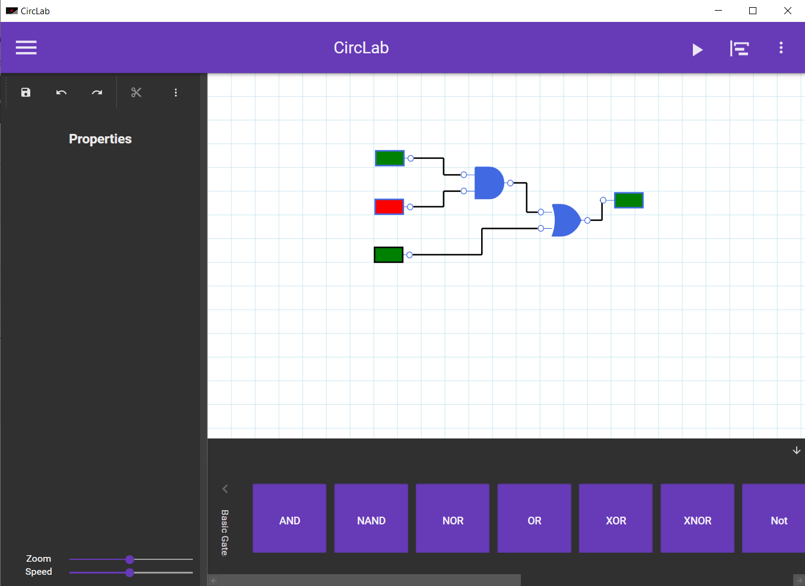

# Circlab: A Desktop Application for Creating Logic Circuits

Circlab is a powerful desktop application that allows users to easily create simple, combinatorial, and sequential logic circuits. Developed in C# and .NET, this application provides a user-friendly interface for designing complex logic circuits using a wide range of basic, combinatorial, and sequential components.

# Key Features

With Circlab, users can take advantage of the following features:

1. Components: Circlab includes a variety of basic components, such as Input, Output, AND, NAND, OR, NOR, NOT, XOR, and XNOR. It also includes combinatorial components like Comparator, Decoder, Encoder, Multiplexer, Demultiplexer, Half/Full Adder, and Half/Sub Adder. Additionally, Circlab offers sequential components like Clock, Chronogram, Register, Circular Register, Counter Mod N, Decounter Mod N, Frequency Divider, RS Latch, and Flip Flop.

2. Project management: Users can open and save projects with ease.

3. Multiple selection: Select multiple components at once for easy editing.

4. Undo/Redo: Circlab includes an undo/redo feature that allows users to easily undo and redo changes made to their circuit design.

5. Copy/Cut/Paste: Copy, cut, and paste components within the circuit for efficient design.

6. Position tracking: The application tracks the position of each component on the circuit board.

7. Zooming/Dezooming: Easily zoom in or out to view the circuit design at different scales.

8. Adjust sequential circuit speed: Users can adjust the speed of sequential circuits to their preference.

